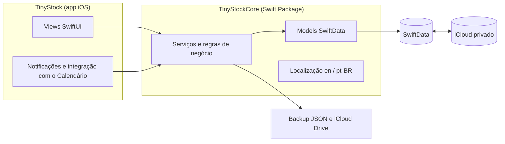
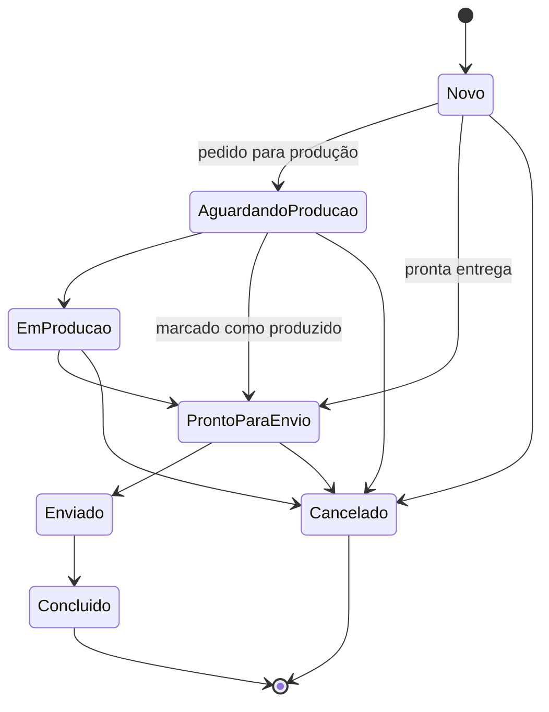

# &nbsp;&nbsp;TinyStock

App para pequenos empreendedores organizarem produtos, estoque e pedidos em um só lugar, sem depender de planilhas.

O TinyStock tem o ciclo operacional completo de uma pequena loja: cadastro de produtos com variações, controle de estoque auditável, pedidos de pronta entrega ou sob encomenda, prazos de produção e despacho no calendário e relatórios financeiros por período.

## Funcionalidades

**Lojas**
- Várias lojas independentes, com troca rápida entre elas.
- Arquivamento e lixeira com restauração por 30 dias.

**Produtos e estoque**
- Produtos com foto, preço de venda, custo e lucro por unidade.
- Variações opcionais (cor, tamanho, modelo), cada uma com seu próprio saldo.
- Toda alteração de estoque gera uma movimentação registrada, o que permite auditar entradas, saídas e ajustes.

**Pedidos**
- Pedidos de pronta entrega ou para produção.
- Canais de venda: venda direta, Shopee, Mercado Livre ou outro canal personalizado, com cálculo de taxas.
- Fluxo de status: novo, aguardando produção, em produção, pronto para envio, enviado, concluído ou cancelado.
- Baixa automática do estoque e registro do retrato financeiro de cada pedido (preço, custo e taxa no momento da venda).

**Calendário e lembretes**
- Calendário interno com prazos de produção e despacho, filtros e atalhos.
- Notificações locais de produção e despacho.
- Exportação dos compromissos para o app Calendário do iPhone.

**Relatórios**
- Receita, custos, taxas e lucro líquido por loja e período.
- Desempenho por canal de venda e produtos mais vendidos.

**Dados e personalização**
- Sincronização automática e privada pelo iCloud (CloudKit).
- Backup em JSON para exportar e importar, além de cópia manual no iCloud Drive.
- Cores de destaque configuráveis.
- Interface em Português do Brasil e English, conforme o idioma do iPhone.
- Suporte a VoiceOver, Dynamic Type, modo claro e modo escuro.

## Arquitetura



- **SwiftUI** para toda a interface.
- **SwiftData** para persistência local, com sincronização pelo **CloudKit** em banco privado do usuário.
- **TinyStockCore**: Swift Package local que concentra models, regras de negócio, serviços, localização e testes. O app fica responsável apenas pela interface e pela integração com o sistema, o que mantém o Core testável e reutilizável em futuras extensões, como widgets.
- **Decimal** em todos os valores monetários, evitando erros de arredondamento.
- **Swift Testing** para os testes automatizados do Core.
- Nenhuma dependência externa: apenas frameworks nativos da Apple.

### Ciclo de um pedido



## Estrutura do repositório

```text
iOS/TinyStock/
├── TinyStock/                 App iOS
│   ├── Views/                 Telas por área: Produtos, Calendário, Relatórios e Ajustes
│   ├── Notifications/         Lembretes locais e navegação a partir das notificações
│   └── Resources/             Info.plist e textos do sistema localizados
├── TinyStockCore/             Swift Package com o domínio do app
│   ├── Sources/TinyStockCore/
│   │   ├── Models/            Lojas, produtos, variações, estoque e pedidos
│   │   ├── Services/          Regras de estoque, pedidos, relatórios, lembretes e backup
│   │   ├── Persistence/       Configuração do SwiftData e do CloudKit
│   │   └── Resources/         Localização en e pt-BR
│   └── Tests/                 Testes automatizados do Core
└── TinyStock.xcodeproj
```

## Requisitos

- iOS 26 ou superior.
- Xcode 27 ou superior.
- Swift 6.

Para executar em um iPhone com sincronização, selecione o seu Team e configure o container do iCloud em **Signing & Capabilities**.

## Privacidade

O TinyStock não exige cadastro e não envia dados ao desenvolvedor. As informações ficam no próprio dispositivo e, quando a sincronização está ativa, na conta privada do iCloud do usuário. Não há servidores próprios, ferramentas de análise ou anúncios.


## Autor

Desenvolvido por **Jonathas Motta** ([@jonathaxs](https://github.com/jonathaxs)).
